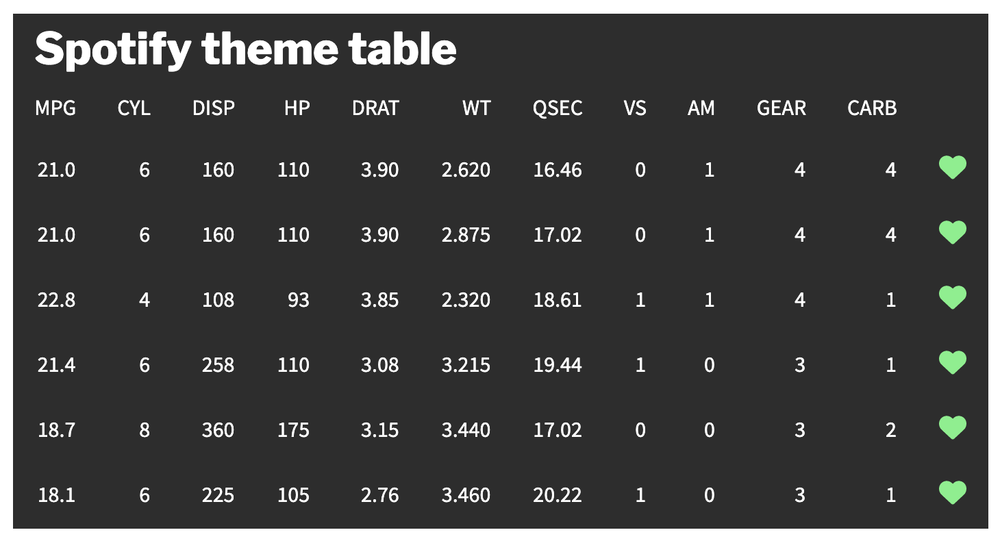
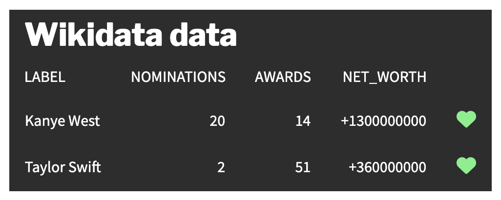

<!-- README.md is generated from README.Rmd. Please edit that file -->

```{r, include = FALSE}
knitr::opts_chunk$set(
  collapse = TRUE,
  comment = "#>",
  fig.path = "man/figures/README-",
  out.width = "100%"
)
```

# karrma

<!-- badges: start -->
[](https://lifecycle.r-lib.org/articles/stages.html#experimental)
[](https://github.com/judith-bourque/karrma/actions/workflows/R-CMD-check.yaml)
<!-- badges: end -->

Compare data on [Taylor Swift and Kanye West](https://en.wikipedia.org/wiki/2009_MTV_Video_Music_Awards#Kanye_West–Taylor_Swift_incident).

## Installation

You can install the development version of karrma from [GitHub](https://github.com/) with:

```{r eval = FALSE}
# install.packages("devtools")
devtools::install_github("judith-bourque/karrma")
```

```{r}
library("karrma")
```

## Examples

### Apply Spotify theme to a gt object

```{r}
library("gt")
library("dplyr")

data <- head(mtcars) %>%
  mutate(like = "heart")

data %>%
  gt() %>%
  tab_header(title = "Spotify theme table") %>%
  cols_label(
  like = ""
  ) %>%
  theme_spotify() %>%
  gtExtras::gt_fa_column(like,
  prefer_type = "solid",
  palette = "lightgreen",
  align = "center") %>% 
  gtsave("man/figures/visualize_spotify.png", expand = 10)
```



### Compare Wikidata data

```{r}
library("gt")
library("dplyr")

data <- get_bio(id = get_qid()) %>% 
  mutate(like = "heart")

data %>%
  gt() %>%
  tab_header(title = "Wikidata data") %>%
  cols_label(
  like = ""
  ) %>%
  theme_spotify() %>%
  gtExtras::gt_fa_column(like,
  prefer_type = "solid",
  palette = "lightgreen",
  align = "center") %>% 
  gtsave("man/figures/visualize_bio.png", expand = 10)
```



### Compare Wikipedia data

```{r}
get_pageviews_raw(granularity = "monthly") %>% 
  head()

visualize_pageviews()
```

