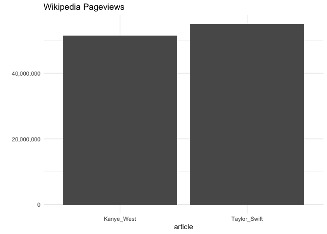

<!-- README.md is generated from README.Rmd. Please edit that file -->

# karrma

<!-- badges: start -->

[](https://lifecycle.r-lib.org/articles/stages.html#experimental)
[](https://github.com/judith-bourque/karrma/actions/workflows/R-CMD-check.yaml)
<!-- badges: end -->

Compare data on [Taylor Swift and Kanye
West](https://en.wikipedia.org/wiki/2009_MTV_Video_Music_Awards#Kanye_West–Taylor_Swift_incident).

## Installation

You can install the development version of karrma from
[GitHub](https://github.com/) with:

``` r
# install.packages("devtools")
devtools::install_github("judith-bourque/karrma")
```

``` r
library("karrma")
```

## Examples

### Apply Spotify theme to a gt object

``` r
library("gt")
library("dplyr")
#> 
#> Attaching package: 'dplyr'
#> The following objects are masked from 'package:stats':
#> 
#>     filter, lag
#> The following objects are masked from 'package:base':
#> 
#>     intersect, setdiff, setequal, union

data <- head(mtcars) %>%
  mutate(like = "heart")

data %>%
  gt() %>%
  tab_header(title = "Spotify theme table") %>%
  cols_label(
  like = ""
  ) %>%
  theme_spotify() %>%
  gtExtras::gt_fa_column(like,
  prefer_type = "solid",
  palette = "lightgreen",
  align = "center") %>% 
  gtsave("man/figures/visualize_spotify.png", expand = 10)
```


### Compare Wikipedia data

``` r
get_pageviews_raw(granularity = "monthly") %>% 
  head()
#>     project language      article     access      agent granularity       date
#> 1 wikipedia       en Taylor_Swift all-access all-agents     monthly 2015-10-01
#> 2 wikipedia       en Taylor_Swift all-access all-agents     monthly 2015-11-01
#> 3 wikipedia       en Taylor_Swift all-access all-agents     monthly 2015-12-01
#> 4 wikipedia       en Taylor_Swift all-access all-agents     monthly 2016-01-01
#> 5 wikipedia       en Taylor_Swift all-access all-agents     monthly 2016-02-01
#> 6 wikipedia       en Taylor_Swift all-access all-agents     monthly 2016-03-01
#>    views
#> 1 736505
#> 2 657281
#> 3 719577
#> 4 623515
#> 5 875317
#> 6 552923

visualize_pageviews()
```


