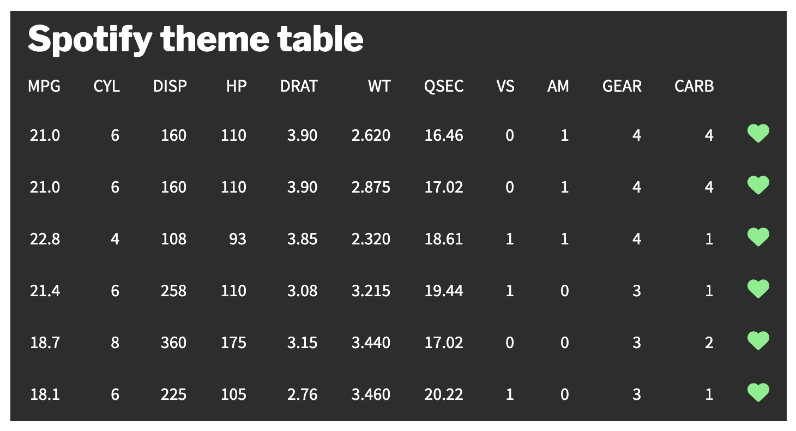

<!-- README.md is generated from README.Rmd. Please edit that file -->

# karrma

<!-- badges: start -->
<!-- badges: end -->

Compare data on [Taylor Swift and Kanye
West](https://en.wikipedia.org/wiki/2009_MTV_Video_Music_Awards#Kanye_West–Taylor_Swift_incident).

## Installation

You can install the development version of karrma from
[GitHub](https://github.com/) with:

``` r
# install.packages("devtools")
devtools::install_github("judith-bourque/karrma")
```

``` r
library("karrma")
library("dplyr")
#> 
#> Attaching package: 'dplyr'
#> The following objects are masked from 'package:stats':
#> 
#>     filter, lag
#> The following objects are masked from 'package:base':
#> 
#>     intersect, setdiff, setequal, union
```

## Prerequisites

``` r
install.packages("spotifyr")
```

Setup Spotify API access token in Renviron:

``` r
usethis::edit_r_environ()

# Insert in Renviron
SPOTIFY_CLIENT_ID = "xxxxxxxxxxxxxxxxxxxxx"
SPOTIFY_CLIENT_SECRET = "xxxxxxxxxxxxxxxxxxxxx"
```

## Examples

### Compare Spotify data

``` r
get_spotify()
#> # A tibble: 2 × 3
#>   name         followers popularity
#>   <chr>            <int>      <int>
#> 1 Taylor Swift  65139572         99
#> 2 Kanye West    19029813         91

visualize_spotify() %>% 
  gt::gtsave("man/figures/visualize_spotify.png", expand = 10)
```



### Compare Wikipedia data

``` r
get_pageviews_raw(granularity = "monthly")
#>     project language      article     access      agent granularity       date
#> 1 wikipedia       en Taylor_Swift all-access all-agents     monthly 2022-12-01
#> 2 wikipedia       en   Kanye_West all-access all-agents     monthly 2022-12-01
#>     views
#> 1  880978
#> 2 1257622

visualize_pageviews()
```


